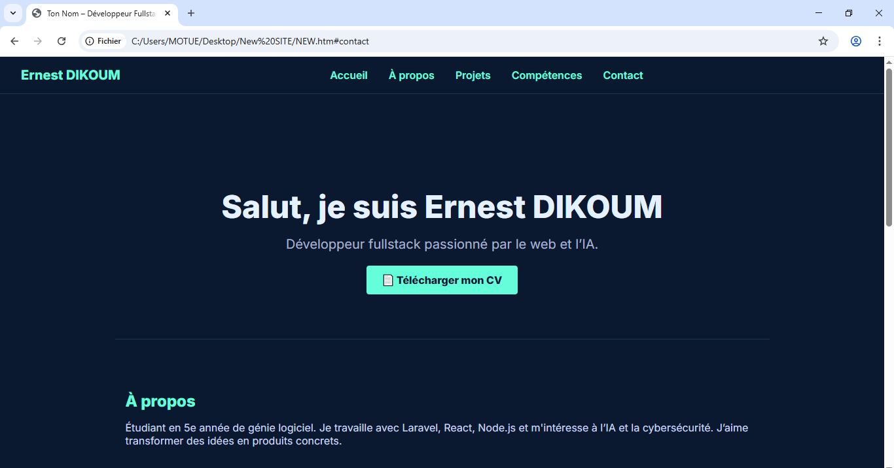

# 🌐 Portfolio – Ernest DIKOUM

Ce projet est mon portfolio personnel développé en HTML, CSS, JS.



---

## 🚀 Fonctionnalités

- Design moderne responsive
- Mode clair/sombre
- Section projets
- Téléchargement de CV
- Sidebar sociale
- Navigation fluide

---

## 🛠️ Stack technique

- HTML5 / CSS3 / JS
- Font Awesome
- LocalStorage

---

## 🔧 Lancer le projet

1. Clone ce repo

```bash
git clone https://github.com/ErnestDikoum/My-porfolio.git
cd porfolio
